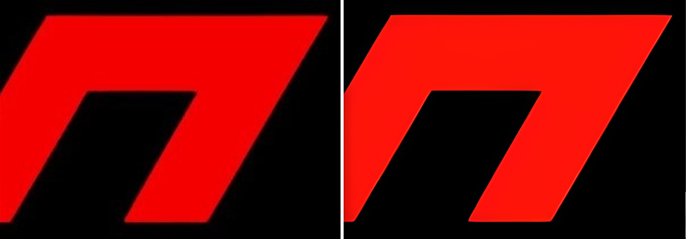
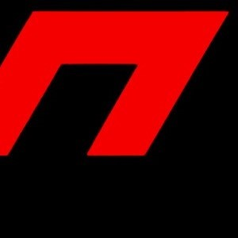
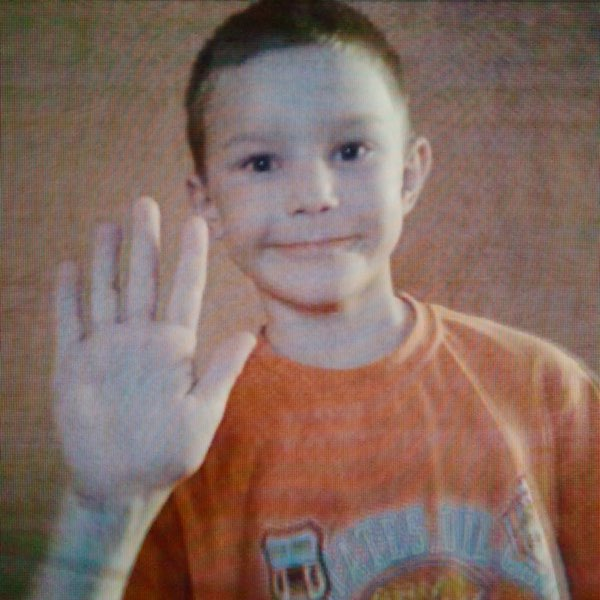

# Image Upscaler

A Python application using a pretrained Real-ESRGAN model for General Image Restoration.



## Requirements
- Python 3.9-
- Libraries: `customtkinter`, `numpy`, `torch`, `pillow`, `basicsr`, `realesrgan`
- RealESRGAN(pretrained model)

## Installation
1. Clone the repository:
   ```bash
   git clone https://github.com/PETROUNKNOWN/imageUpscaler.git

2. Install the required libraries:
    ```bash
    pip install customtkinter numpy torch pillow basicsr realesrgan

4. RealESRGAN Original Source:
   - Real-ESRGAN [Github Project](https://github.com/xinntao/Real-ESRGAN):
      - Download `RealESRGAN_x4plus.pth` from [`Releases`](https://github.com/xinntao/Real-ESRGAN/releases/tag/v0.1.1):
        - `v0.1.1`
        - Commit: `2ed9863`
      - Move the `RealESRGAN_x4plus.pth` file to the script directory.

## Note
- Supports `.png`, `.jpg`, and `.jpeg` file formats.
- Outputs `.png` format.
- The model requires a lot of compute hence a dedicated GPU is highly recommended

## Screenshots

#### Input

#### Output 

#### Input

#### Output  


### Limitations
#### Input
 
#### Output 


<details>
  <summary>Credits</summary>
  Image 2 Narvent: [Album-Insomnia]
  Image 3 DVRST: [Album-Echoes of Childhood]
</details>

<!-- syndicat -->